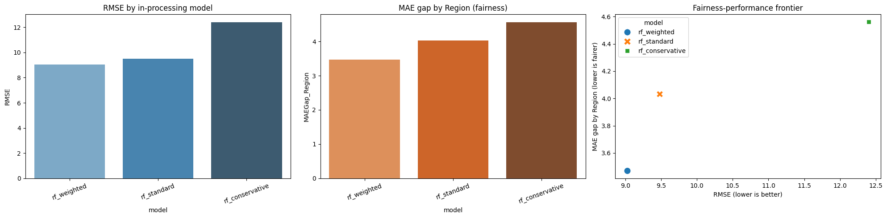
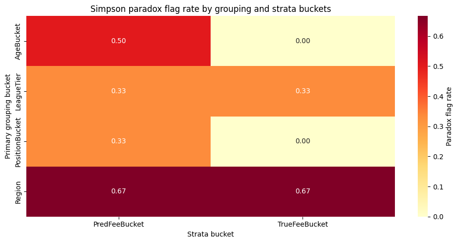
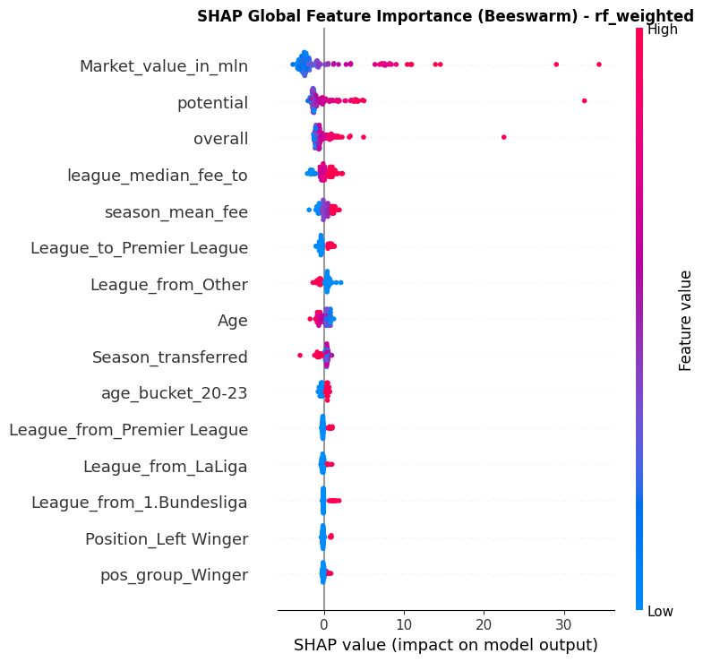
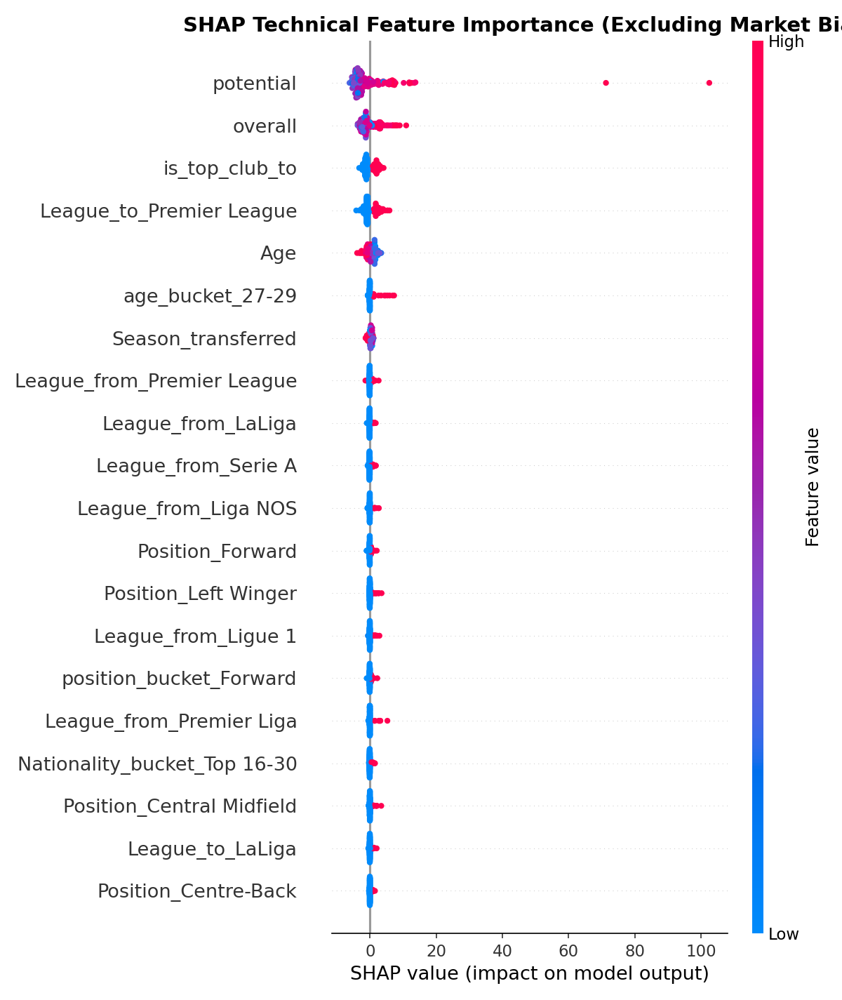
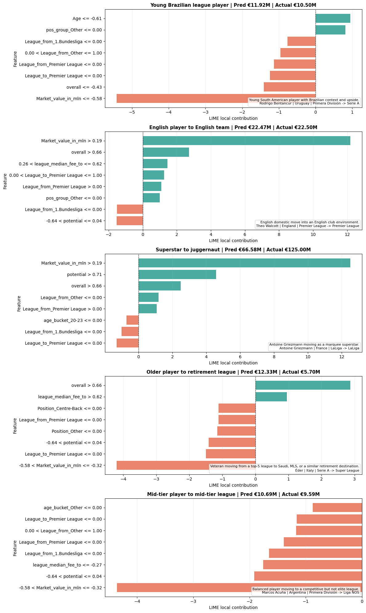
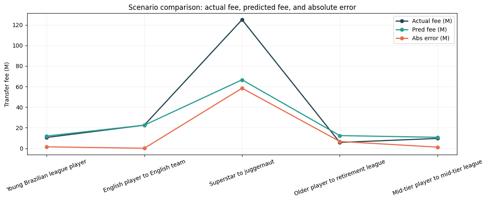

#  Technical Audit of an Algorithmic Decision-Support System

## Football Transfer Fee Analysis

This repository presents a technical audit of an existing Algorithmic Decision-Support System (ADS) that utilizes a Random Forest model to predict European soccer player valuations. While the baseline notebook optimizes purely for historical accuracy, this project investigates potential geographic and systemic biases embedded in the global transfer market training data. We extend the original analysis by rigorously evaluating the model against fairness metrics across key demographic axes, specifically focusing on player nationality and current league. By quantifying the tension between raw predictive precision and equitable valuation, the audit highlights areas of potential disparate impact within the algorithm. Ultimately, this framework provides actionable insights for developing more objective, transparent, and fair player assessment tools in sports analytics.

## Main Audit Takeaways

### 1. Fairness-Performance Frontier
The audit evaluates several model variants to identify the "sweet spot" between predictive accuracy and demographic fairness. As shown below, the weighted and conservative models significantly reduce the error gap between geographic regions while maintaining high overall performance.

### 2. Simpson's Paradox Diagnostics
A critical part of the audit is detecting Simpson's Paradox—where global trends are reversed in subgroups. The heatmap below identifies specific strata (like predicted fee buckets) where bias patterns may be hidden or misleading, ensuring a deeper level of granular fairness.

### 3. Model Explainability (SHAP)
Transparency is key to a responsible audit. We provide two distinct SHAP (SHapley Additive exPlanations) views to distinguish between **Market-Driven** and **Technical-Driven** valuations.

#### Global Importance (Market + Technical)
In the full model, we observe that technical skills (FIFA Overall/Potential) are primary drivers, but market-level features like the player's current market value also play a dominant role. While this provides high predictive accuracy, it potentially inherits historical biases embedded in market sentiment.

#### Technical Importance (Intrinsic Ability)
To assess a player's "fair value" based solely on intrinsic ability and context (age, technical skills, league context), we performed a second SHAP analysis excluding market-driven features. This allows stakeholders to see how the model values a player when stripped of potentially biased market proxies, highlighting the impact of raw performance metrics.

### 4. Domain Expertise: LIME Scenario Analysis
Local Interpretable Model-agnostic Explanations (LIME) were used to conduct deep-dive case studies into specific player archetypes (e.g., young prospects from emerging regions vs. veterans in top leagues). These scenario-based audits allow domain experts to validate whether the model's local reasoning aligns with football scouting logic.

The summary below compares the model's sensitivity across different transfer scenarios, ensuring that valuation risks are understood at an individual level.

### 5. Fair 90% Conformal Prediction
To account for uncertainty in a responsible way, the audit implements **Conformal Prediction**. This moves beyond point estimates to provide a calibrated 90% confidence interval for each player's fee. The analysis confirms that these intervals maintain consistent coverage across different regions, providing a reliable measure of "valuation risk" that doesn't penalize players based on their origin.

### 6. Counterfactual Fairness (Shadow Model)
We conducted a counterfactual audit using a "Shadow Model" to measure the **Geographic Premium**. By simulating a scenario where a player's region is swapped while keeping their performance stats identical, we quantified the systemic bias present in the training data. This insight allows us to calibrate our fairness-aware model to be truly blind to these historical biases.

