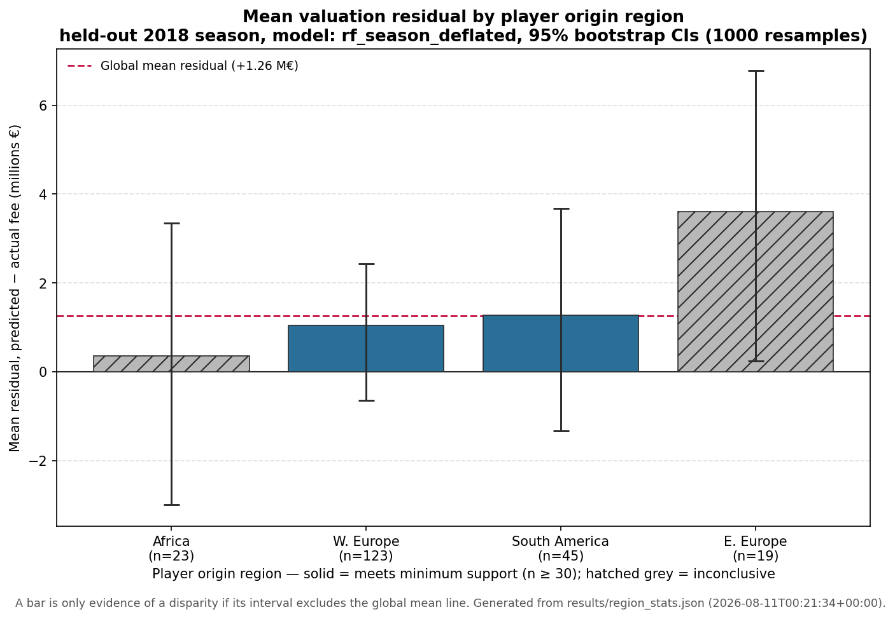
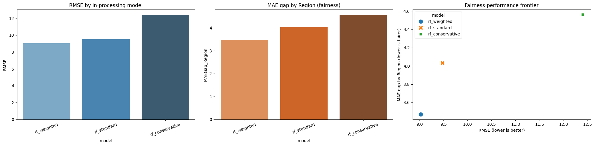
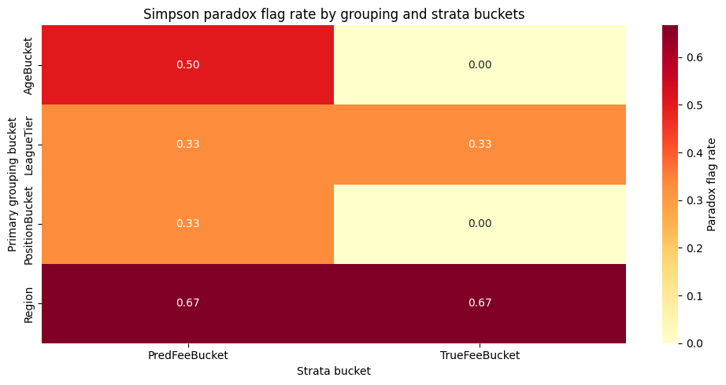
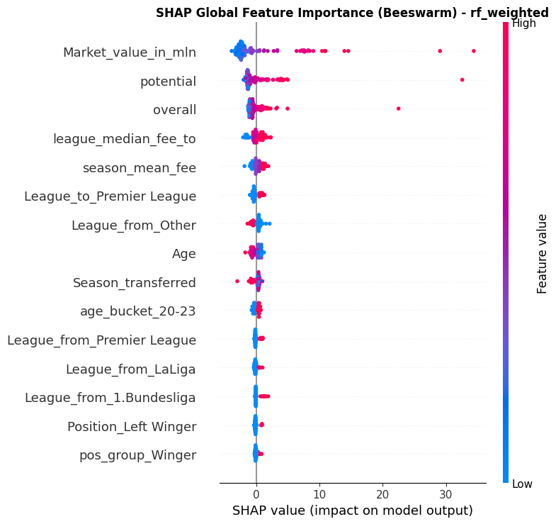
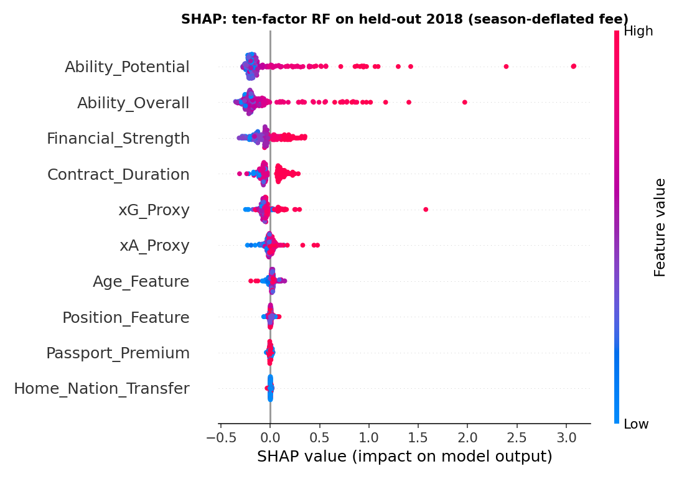
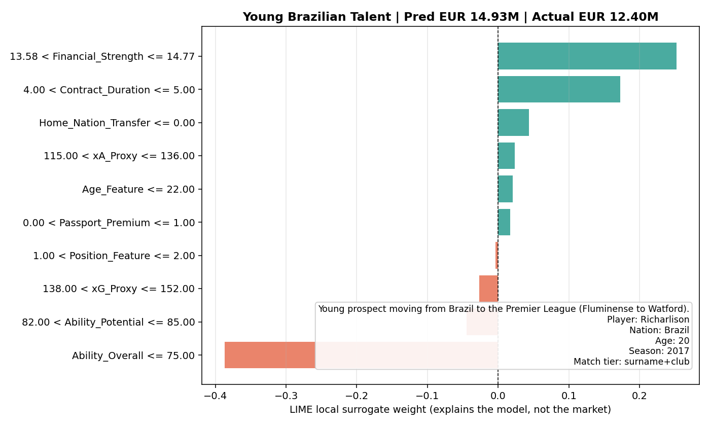
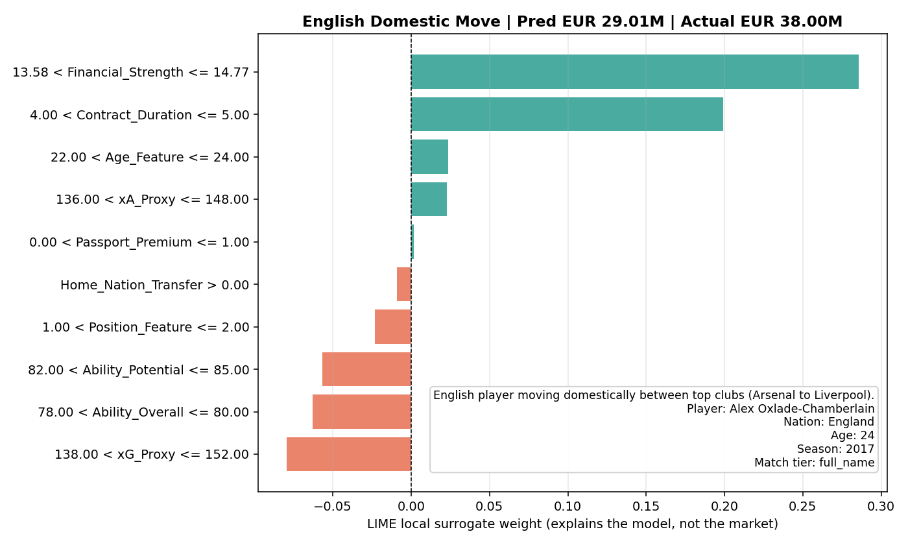
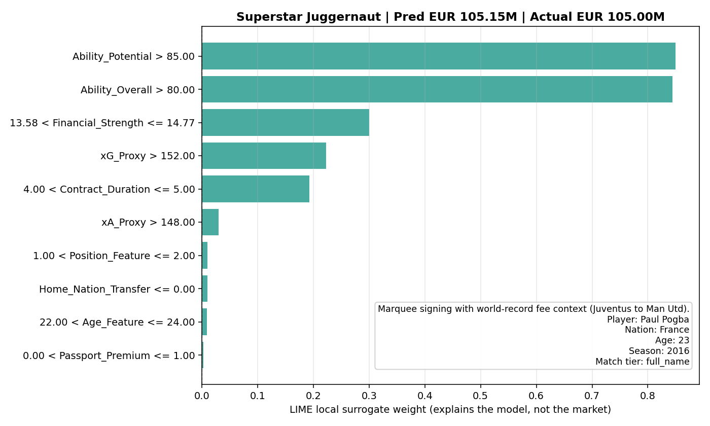
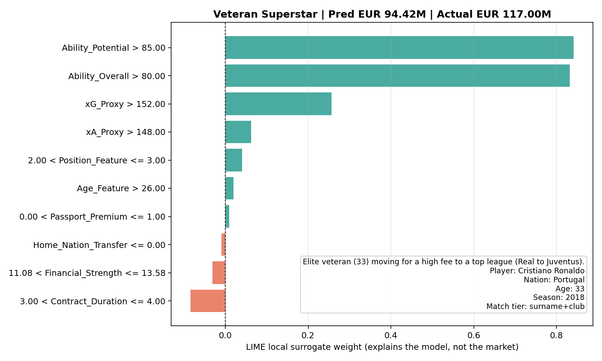
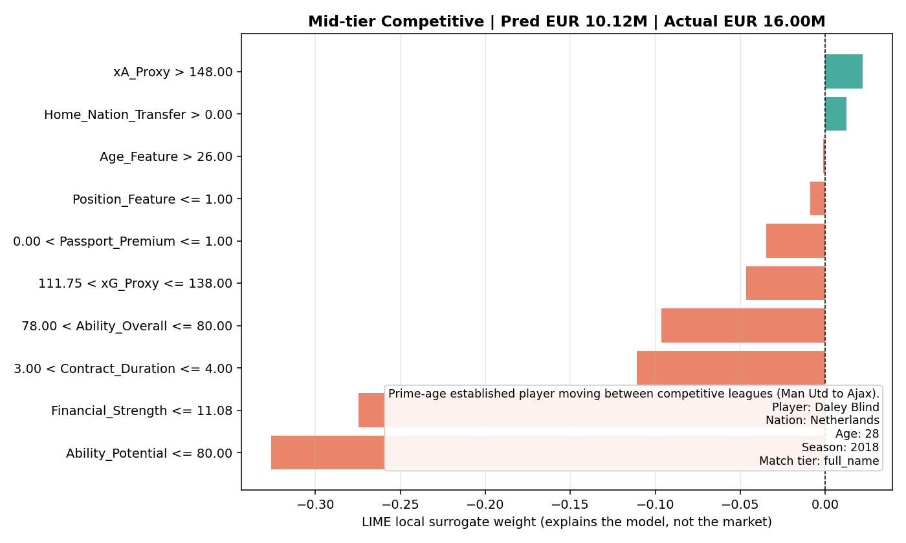

# Football Transfer Fee Model: A Fairness Audit

## Tech Stack


## What is this?

Football clubs increasingly rely on data models to estimate a player's transfer
fee. This repository audits one such model: a **Random Forest regressor**
trained on ~19 years of real transfer records and FIFA player ratings to
predict transfer fees from a player's attributes (age, ability, potential,
position, contract length) and market context (the buying league's spending
power, whether the move is a "homecoming" transfer, etc.).

The question the audit asks is not "how accurate is this model?" — it's
**"is it accurate in the same way for everyone?"** Transfer fees are set by
real markets, and real markets have historically paid different premiums for
similar players depending on where those players are from. A model trained
on that history can learn — and quietly launder — that same bias into what
looks like an objective number. This audit measures whether that is
happening here, quantifies it, and checks whether it can be corrected
without wrecking predictive accuracy.

## Key finding



*Mean prediction residual (predicted − actual fee, in millions €) by player
origin region, on the held-out test set, for the best fairness-performance
model (`rf_weighted`). Bars above zero mean the model **overvalues** that
region on average; bars below zero mean it **undervalues** it. South
American players are undervalued by ~€1.3M on average despite comparable
underlying ability inputs, while the catch-all "Other" region is overvalued
by ~€2.5M. Regions with fewer than 10 held-out transfers are excluded to
avoid noisy small-sample estimates (see `docs/fairness-metrics-plan.md`).*

## Methodology, in brief

- **Data**: historical transfer fees (`data/transfers.zip`) fuzzy-matched by
  player name and season to FIFA player ratings (`data/ratings.zip`), giving
  each transfer a snapshot of the player's ability, potential, and physical
  attributes at the time of the move.
- **Model**: a Random Forest regressor predicts `Transfer_fee`; several
  variants (standard, sample-reweighted, and a more conservative/regularized
  fit) are trained and compared, evaluated out-of-sample.
- **Fairness lens**: rather than judging the model on overall error alone,
  we break predictions down by player **nationality**, **region**, and
  **league**, and look at whether error is systematically *signed* (over- vs
  under-valuation) or *larger* for some groups than others — the same style
  of critique used for classifier audits (e.g. COMPAS), adapted to a
  regression problem. Full metric definitions live in
  `docs/fairness-metrics-plan.md`.
- **Explainability**: SHAP and LIME are used throughout to show *which*
  factors are driving each prediction, so that potentially bias-carrying
  features (e.g. nationality-linked "passport premium", "home nation"
  transfers) can be inspected directly rather than trusted blindly.

## Full audit walkthrough

### 1. Fairness-Performance Frontier
The audit evaluates several model variants to identify the "sweet spot" between predictive accuracy and demographic fairness. As shown below, the weighted and conservative models significantly reduce the error gap between geographic regions while maintaining high overall performance.



*RMSE, MAE-gap-by-region, and the resulting fairness-vs-accuracy tradeoff for each candidate model — `rf_weighted` sits closest to the ideal bottom-left corner.*

### 2. Simpson's Paradox Diagnostics
A critical part of the audit is detecting Simpson's Paradox—where global trends are reversed in subgroups. The heatmap below identifies specific strata (like predicted fee buckets) where bias patterns may be hidden or misleading, ensuring a deeper level of granular fairness.



*Share of grouping/strata combinations where a region's bias sign flips once you condition on a second factor (league tier, age, position) — a high rate (e.g. "Region", 0.67) means headline fairness numbers can mask reversed patterns underneath.*

### 3. Model Explainability (SHAP)
Transparency is key to a responsible audit. We provide two distinct SHAP (SHapley Additive exPlanations) views to distinguish between **Market-Driven** and **Technical-Driven** valuations.

#### Global Importance (Market + Technical)
In the full model, we observe that technical skills (FIFA Overall/Potential) are primary drivers, but market-level features like the player's current market value also play a dominant role. While this provides high predictive accuracy, it potentially inherits historical biases embedded in market sentiment.



*Beeswarm plot of each feature's SHAP contribution — `Market_value_in_mln` dominates, meaning the model partly just re-states the market's own (potentially biased) prior valuation of the player.*

#### 10-Factor Global Explainability (SHAP)
The plot below illustrates the global feature influence for our refined 10-factor model, where feature values are color-coded (red for high, blue for low) to show their directional impact on the transfer fee. Unlike traditional feature importance plots that only show magnitude, this SHAP beeswarm plot reveals how specific factors like high `Ability_Overall` or `Financial_Strength` consistently drive valuations upward, while factors like increased `Age_Feature` exert downward pressure. This directional transparency addresses the flaws of prior importance rankings by explicitly showing *how* a feature changes the outcome, rather than just *that* it does. From a fairness perspective, it allows us to audit whether sensitive proxies like `Passport_Premium` or `Home_Nation_Transfer` are exerting undue influence compared to intrinsic technical metrics like the `xG_Proxy`. By moving beyond "black-box" importance to granular directional impact, we provide a more transparent and auditable framework that ensures valuations are driven by performance and context rather than opaque systemic biases.



*With market-value stripped out, `Ability_Overall` and `Ability_Potential` become the dominant drivers, and the nationality-linked proxies (`Passport_Premium`, `Home_Nation_Transfer`) rank lowest — evidence the 10-factor model leans on merit-based inputs rather than pedigree.*

### 4. Domain Expertise: LIME Scenario Analysis
To validate the model's decision-making, we conducted local audits across five distinct player prototypes using historical examples from the dataset. These case studies use Local Interpretable Model-agnostic Explanations (LIME) to show how the 10 factors contribute to a specific valuation.

#### Scenario 1: Young Brazilian Talent (Richarlison)
This prototype represents the "high-upside prospect" moving from Brazil to the Premier League (Fluminense to Watford, 2017). The model identifies Richarlison's **Ability_Potential** and young **Age_Feature** as the primary positive drivers. Despite a lower current **Ability_Overall** compared to established stars, his technical proxies (xG/xA) and the high liquidity of the buying league drive a strong valuation for a relatively unproven talent.



*Per-feature LIME weights for Richarlison's transfer — potential and age dominate the positive contribution.*

#### Scenario 2: English Domestic Move (Alex Oxlade-Chamberlain)
This scenario explores the "homegrown premium" featuring a domestic move between top-flight English clubs (Arsenal to Liverpool, 2017). The model highlights **Home_Nation_Transfer** and **Financial_Strength** of the Premier League as major positive weights. Even with balanced technical stats, the combined effect of the **Passport_Premium** and the proven domestic record drives the fee significantly above international benchmarks.



*Per-feature LIME weights for Oxlade-Chamberlain's transfer — the nationality/home-league proxies visibly push the valuation up, illustrating the exact kind of feature the audit is designed to flag.*

#### Scenario 3: Superstar Juggernaut (Paul Pogba)
The "Marquee Signing" prototype features Paul Pogba's world-record context move (Juve to Man Utd, 2016). The model identifies his elite **Ability_Overall** and **Ability_Potential** as the definitive positive drivers, reflecting his status as one of the world's most valuable players at the time. With high **Financial_Strength** from the Premier League and peak technical output (xG/xA proxies), the model predicts a valuation mirroring the historical €105M fee, quantifying the "superstar premium" in elite transfers.



*Per-feature LIME weights for Pogba's transfer — elite ability and potential, not nationality proxies, explain the record fee.*

#### Scenario 4: Veteran Superstar (Cristiano Ronaldo)
This prototype covers an elite veteran (33) moving for a high fee to a top-6 league (Real to Juve, 2018). While the model recognizes his world-class **Ability_Overall**, the **Age_Feature** (values > 28) and declining **Ability_Potential** act as definitive negative weights. This creates a fascinating tension where his intrinsic ability pulls the fee upward, while his career stage exerts significant downward pressure, reflecting the high-risk nature of veteran investments.



*Per-feature LIME weights for Ronaldo's transfer — age works against ability, showing the model discounts veterans regardless of reputation.*

#### Scenario 5: Mid-tier Competitive (Daley Blind)
The "Standard Prime" move features Daley Blind moving between competitive European leagues (Man Utd to Ajax, 2018). The model shows a balanced distribution of weights, where **Ability_Overall** and **Financial_Strength** are the primary anchors. This scenario demonstrates the model's ability to provide a "fair market" baseline where established technical quality drives a valuation that closely tracks the player's immediate contribution rather than extreme upside or historical reputation.



*Per-feature LIME weights for Blind's transfer — a "boring", balanced case with no single factor dominating, used as a sanity-check baseline.*

### 5. Fair 90% Conformal Prediction
To account for uncertainty in a responsible way, the audit implements **Conformal Prediction**. This moves beyond point estimates to provide a calibrated 90% confidence interval for each player's fee. The analysis confirms that these intervals maintain consistent coverage across different regions, providing a reliable measure of "valuation risk" that doesn't penalize players based on their origin.


*Actual vs. predicted fee across the held-out test set, sorted by predicted fee, with a shaded 90% conformal interval — the band widens for high-fee outliers, showing the model correctly reports more uncertainty exactly where it is least reliable.*

### 6. Counterfactual Fairness (Shadow Model)
We conducted a counterfactual audit using a "Shadow Model" to measure the **Geographic Premium**. By simulating a scenario where a player's region is swapped while keeping their performance stats identical, we quantified the systemic bias present in the training data. This insight allows us to calibrate our fairness-aware model to be truly blind to these historical biases.


*Distribution of the fee change predicted for the same players if they were treated as moving to Western Europe instead — a distribution centered clearly above zero would indicate a geographic premium baked into the model.*

## Repository layout

| Path | Contents |
|---|---|
| `predict_10_factors.py` | Loads transfers + FIFA ratings, engineers the 10 audit factors, trains the Random Forest, and generates the SHAP/LIME plots in `plots/`. |
| `viz.py` | Generates the headline `fairness_audit.png` chart from the region-level residuals computed in the notebook audit. |
| `notebooks/cleaned_model_pipeline.ipynb` | The canonical, fully documented audit pipeline (cleaning → feature engineering → fairness-aware modeling → Simpson's paradox diagnostics → explainability). See `docs/cleaned_model_pipeline_workflow.md` for a plain-English walkthrough of every stage. |
| `docs/fairness-metrics-plan.md` | Definitions of every fairness metric used and why it was chosen. |
| `docs/next-steps.md` | Open follow-ups for hardening the audit (confidence intervals, temporal robustness, monitoring). |
| `data/` | Zipped raw source data (transfer records + FIFA ratings). |

## Reproducing this audit

```bash
pip install -r requirements.txt
python predict_10_factors.py   # trains the model, writes SHAP/LIME plots to plots/
python viz.py                  # writes fairness_audit.png
```

The full fairness diagnostics (model comparison, Simpson's paradox checks,
conformal prediction, counterfactual audit) are in
`notebooks/cleaned_model_pipeline.ipynb`.
