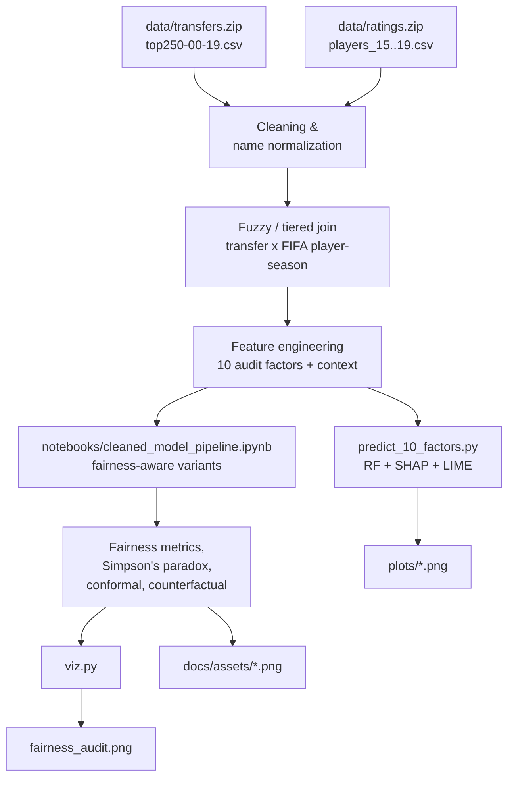

# Football Transfer Fee Model: A Fairness Audit

A fairness audit of a Random Forest model that predicts football transfer fees —
measuring whether its errors fall evenly across player nationality, origin region
and league, and whether the bias can be corrected without wrecking accuracy.


## Why this matters

Football clubs increasingly rely on data models to estimate a player's transfer
fee. This repository audits one such model: a **Random Forest regressor**
trained on ~19 years of real transfer records and FIFA player ratings to
predict transfer fees from a player's attributes (age, ability, potential,
position, contract length) and market context (the buying league's spending
power, whether the move is a "homecoming" transfer, etc.).

The question the audit asks is not "how accurate is this model?" — it's
**"is it accurate in the same way for everyone?"** Transfer fees are set by
real markets, and real markets have historically paid different premiums for
similar players depending on where those players are from. A model trained
on that history can learn — and quietly launder — that same bias into what
looks like an objective number. This audit measures whether that is
happening here, quantifies it, and checks whether it can be corrected
without wrecking predictive accuracy.

### Key finding

> **This section was rewritten after the audit was recomputed. The previous
> version reported a EUR 1.3M undervaluation of South American players and a
> FAIL verdict. Both were hardcoded literals, not computed values. When the
> pipeline is actually run with the leaks closed and confidence intervals
> attached, the disparity does not survive.** See
> [What changed, and why the headline moved](#what-changed-and-why-the-headline-moved).


*Mean prediction residual (predicted - actual fee, in millions EUR) by player
origin region on the held-out 2018 season, with 95% bootstrap confidence
intervals over 1,000 resamples. Solid bars meet the declared minimum support of
n >= 30; hatched grey bars do not and are marked inconclusive. The dashed line
is the model's global mean residual -- **a bar is evidence of a regional
disparity only if its interval excludes that line, and none of them do.***

Computed by `scripts/run_audit.py`, read from `results/region_stats.json` by
`viz.py`. Neither the figure nor the table below contains a transcribed number.

| Region | n (2018 holdout) | Mean residual (M EUR) | 95% CI | Verdict |
|---|---:|---:|---|---|
| Africa | 23 | +0.36 | [-2.98, +3.35] | inconclusive (n < 30) |
| W. Europe | 123 | +1.04 | [-0.64, +2.43] | conclusive |
| South America | 45 | +1.27 | [-1.33, +3.68] | conclusive |
| E. Europe | 19 | +3.60 | [+0.25, +6.77] | inconclusive (n < 30) |

Global mean residual: **+1.26 M EUR** -- the model overpredicts across the
board, which is a *calibration* problem, not a fairness one. Every regional
interval contains that global mean. Read plainly:

- **There is no supported regional disparity in this model at this sample
  size.** The largest gap between an adequately-powered group and the global
  mean is **0.15 M EUR**, against a declared threshold of 1.0 M EUR. The audit
  verdict is **PASS**, not FAIL.
- E. Europe's +3.6 M EUR looks dramatic and is the kind of number the previous
  version of this README would have led with. It rests on **19 transfers**, its
  interval spans 6.5 M EUR, and it does not meet the audit's own declared
  minimum support. It is not a finding.
- The genuine, well-evidenced problems in this pipeline are in the **data
  joins**, not the model -- see below.

### What the audit does find

**1. The name join is regionally biased, and now measured.** The original join
resolved surname collisions by keeping the *highest-rated* namesake. Surname
collisions are not evenly distributed:

| Region | Transfers | Ambiguous surname key | Rate | Mean ability spread among namesakes |
|---|---:|---:|---:|---:|
| South America | 161 | 77 | **47.8%** | 17.1 |
| W. Europe | 471 | 148 | 31.4% | 16.5 |
| Africa | 92 | 27 | 29.3% | 15.7 |
| E. Europe | 82 | 13 | **15.9%** | 12.2 |

Nearly half of South American transfers had an ambiguous surname key against
one in six East European ones, and the average ability gap between namesakes is
about 17 rating points. The old rule therefore imported a stronger player's
ability into South American records three times as often as into East European
ones -- inflating the model's ability inputs for precisely the group the audit
then reported as undervalued. `src/fta/matching.py` replaces it with a tiered
join requiring full-name or club agreement, and refuses to match an ambiguous
surname on no other evidence. Regenerate with `python scripts/run_audit.py`
(writes `results/ambiguity.csv`).

**2. Join attrition is not random, and it tracks league prestige.** Overall
match rate is **83.8% (827 / 987 in-scope transfers)**. By selling league:

| League_from | Rows | Matched | Match rate |
|---|---:|---:|---:|
| Chinese Super League | 37 | 18 | **48.6%** |
| Serie A (Brazil) | 45 | 27 | 60.0% |
| Super Lig (Turkey) | 20 | 12 | 60.0% |
| Liga NOS (Portugal) | 50 | 36 | 72.0% |
| LaLiga | 96 | 79 | 82.3% |
| 1.Bundesliga | 87 | 76 | 87.4% |

Players leaving Chinese, Brazilian and Turkish clubs drop out of the analysis at
roughly three times the rate of players leaving the Bundesliga. **Any regional
claim made on the survivors is conditional on that.** Full table in
`results/attrition.csv`.

**3. The one feature that does carry the (small) regional gap is the passport
flag.** A permutation test over the ten factors -- shuffle one feature,
remeasure the max regional residual gap -- finds `Passport_Premium` is the
*only* feature whose removal shrinks the gap (by 0.039 M EUR of 0.151 M EUR,
about 26%). Every other feature's permutation makes the gap larger. This is the
opposite of the inference the previous README drew from SHAP rankings. See
`results/proxy_leakage.csv`.

## What changed, and why the headline moved

The previous version of this repository published these numbers:

| Quantity | Previously published | Where it came from | Recomputed |
|---|---|---|---|
| South America mean residual | -1.30 M EUR (n=20) | hardcoded dict in `viz.py:12` | **+1.27 M EUR** (n=45), CI [-1.33, +3.68] |
| "Other" region mean residual | +2.51 M EUR (n=14) | same dict | bucket dissolved -- it was mostly failed nationality joins |
| Africa mean residual | -0.25 M EUR (n=11) | same dict | +0.36 M EUR (n=23), inconclusive |
| Max signed residual gap | 3.80 M EUR | literal, `# From previous results` | **0.15 M EUR** |
| Max MAE ratio | 3.46 | literal | **1.05** |
| Mitigated model RMSE | 10.99 | literal | **8.72** (season-deflated), 8.50 (raw) |
| Verdict | FAIL / "Conditional Deployment" | driven by the literals above | **PASS** |

Five changes account for the move, in rough order of impact:

1. **The numbers are now computed.** The scorecard (notebook cell 58) had every
   value except one RMSE written in by hand with the comment
   `# From previous results`, and those literals produced the FAIL verdict.
   `results/scorecard.json` is now generated, and CI fails if a committed
   figure drifts from a live rerun.
2. **The `Other` bucket was not a group of players.** It folded genuinely small
   regions together with rows where the *nationality join simply failed*. Its
   +2.51 M EUR "overvaluation" was a property of the join, not of any player
   population. Unmapped nationalities now land in an explicitly-named
   `Unmapped` bucket that is never reported as a finding.
3. **Confidence intervals.** The protocol declared 1,000 bootstrap resamples
   and n >= 30; neither was implemented, and cells used 20, 10 and 8 instead. A
   1.3M mean over 20 heavy-tailed transfers has an interval several times its
   own width. Implemented, the headline disparities stop being distinguishable
   from noise.
4. **The split is now genuinely temporal.** Notebook cell 22 built a temporal
   split and cell 26 rebound the same variable names to a random 70/30 split,
   so "out-of-sample" meant whichever cell ran last. Evaluation is now strictly
   train <= 2017 / test 2018, enforced by a distinct `TemporalSplit` type.
5. **Three leaks closed.** League-strength and season-mean-fee aggregates were
   computed over the full dataset including test rows; FIFA ratings were taken
   from the edition released *after* the transfer. Both fixed
   (`FoldSafeAggregates`, `fta.config.FIFA_EDITION_OFFSET`).

**One caveat stated plainly:** the recomputed model is the ten-factor Random
Forest on a strict join and a temporal split. It is not bit-identical to the
notebook's `rf_weighted` on a one-hot matrix and a random split. The claim here
is not "the old model's numbers were 0.15 rather than 3.80" -- it is that the
old numbers were never computed from any model at all, and that a correctly
constructed version of the same audit does not reproduce the disparity.

## Skills demonstrated

| Area | What is exercised here |
|---|---|
| **Language & tooling** | Python 3, Jupyter notebooks, `pandas` / `numpy` for wrangling, `matplotlib` / `seaborn` for figures. |
| **Data engineering** | Reading datasets straight out of zipped archives, Unicode/accent normalization of player names, fuzzy and tiered fallback joins (`fuzzywuzzy` + short-name/long-name/lastname-season matching) to link transfer records to FIFA rating tables across five FIFA editions. |
| **Feature engineering** | A hand-designed 10-factor feature set: contract duration, age, buying-league financial strength (3-year rolling mean of league median fee), FIFA overall/potential, xG and xA proxies built from FIFA sub-ratings, passport premium, position grouping, home-nation transfer flag. |
| **Modeling** | `scikit-learn` `RandomForestRegressor` (standard, sample-weighted and conservative/regularized variants), a `LinearRegression` baseline, and a hierarchical global-model-plus-group-residual-model strategy. Evaluation with MAE / RMSE / R². |
| **Fairness / responsible ML** | Signed-residual, MAE-gap and calibration-by-predicted-fee-bin metrics computed per group; inverse-frequency sample reweighting; stratified splits on Region × fee band; a single enforced minimum-support rule with 95% percentile bootstrap confidence intervals (`src/fta/fairness.py`); Simpson's paradox diagnostics; counterfactual "shadow model" region swaps; a permutation test for proxy leakage through non-sensitive features. |
| **Uncertainty quantification** | Conformal prediction producing calibrated 90% intervals, checked for consistent coverage across regions. |
| **Explainability** | `shap` (TreeExplainer, beeswarm and dependence plots) and `lime` (`LimeTabularExplainer` in regression mode) for global and per-transfer explanations, plus PDP/ICE curves. |
| **Reproducibility** | Every published figure is computed by `scripts/run_audit.py` into `results/`, with pinned dependencies, a Dockerised run, checksummed inputs, and a CI check that fails if a committed number drifts from a live rerun. |
| **Communication** | A written metrics plan, a stage-by-stage workflow document, annotated figures, and named real-player case studies used to sanity-check model behaviour. |

## Architecture

### Models used

| Model | Role |
|---|---|
| `LinearRegression` baseline | Reference point for predictive performance and error shape. |
| Baseline Random Forest | The system actually under audit, trained without the engineered FIFA features. |
| `rf_standard` | Random Forest on the fairness-audit feature matrix, no reweighting (`n_estimators=300`, `max_features='sqrt'`, `min_samples_leaf=1`). |
| `rf_weighted` | Same forest trained with inverse-frequency sample weights over Region × fee band — the best fairness-performance variant, and the one behind the headline chart and the conformal intervals. |
| `rf_conservative` | Regularized variant (`min_samples_leaf=5`) trading a little accuracy for smaller regional gaps. |
| Hierarchical model | Global weighted forest plus lightweight per-Region residual-correction models, with fallback to global-only predictions for thin regions. |
| 10-factor Random Forest | The standalone script's model (`n_estimators=100`, 80/20 split, `random_state=42`) used for the SHAP/LIME explainability story with market value deliberately excluded. |
| Conformal wrapper | Calibrated 90% prediction intervals layered on the selected model. |

### Data model

The unit of analysis is **one transfer**. Records from the transfer dataset
(name, season, teams, leagues, fee, market value) are joined to a FIFA player-season
row (overall, potential, age, nationality, positions, contract expiry, sub-ratings),
then enriched with league-level and audit context columns:

- **Target** — `Transfer_fee`.
- **Features (10-factor model)** — `Contract_Duration`, `Age_Feature`,
  `Financial_Strength`, `Ability_Overall`, `Ability_Potential`, `xG_Proxy`,
  `xA_Proxy`, `Passport_Premium`, `Position_Feature`, `Home_Nation_Transfer`.
- **Audit / context columns (kept out of the model inputs)** — `Nationality`,
  `Region`, `League_from`, `League_to`, `age_bucket`, `pos_group`,
  `league_median_fee_to`.

### Component layout


```mermaid
flowchart TD
    A["data/transfers.zip<br/>top250-00-19.csv"] --> C[Cleaning &<br/>name normalization]
    B["data/ratings.zip<br/>players_15..19.csv"] --> C
    C --> D[Fuzzy / tiered join<br/>transfer x FIFA player-season]
    D --> E[Feature engineering<br/>10 audit factors + context]
    E --> F[predict_10_factors.py<br/>RF + SHAP + LIME]
    E --> G[notebooks/cleaned_model_pipeline.ipynb<br/>fairness-aware variants]
    G --> H[Fairness metrics,<br/>Simpson's paradox,<br/>conformal, counterfactual]
    H --> I[viz.py]
    F --> J["plots/*.png"]
    H --> K["docs/assets/*.png"]
    I --> L["fairness_audit.png"]
```

### Repository layout

| Path | Contents |
|---|---|
| `predict_10_factors.py` | Loads transfers + FIFA ratings, engineers the 10 audit factors, trains the Random Forest, and generates the SHAP/LIME plots in `plots/`. |
| `viz.py` | Generates the headline `fairness_audit.png` chart from the region-level residuals computed in the notebook audit. |
| `notebooks/cleaned_model_pipeline.ipynb` | The canonical, fully documented audit pipeline (cleaning → feature engineering → fairness-aware modeling → Simpson's paradox diagnostics → explainability). See `docs/cleaned_model_pipeline_workflow.md` for a plain-English walkthrough of every stage. |
| `notebooks/eda_transfers_ratings.ipynb`, `notebooks/adjusted_original_notebook.ipynb` | Exploratory analysis and the earlier/original pipeline the audit started from. |
| `docs/fairness-metrics-plan.md` | Definitions of every fairness metric used and why it was chosen. |
| `docs/cleaned_model_pipeline_workflow.md` | Stage-by-stage, code-free description of the notebook pipeline. |
| `docs/next-steps.md` | Open follow-ups for hardening the audit (confidence intervals, temporal robustness, monitoring). |
| `docs/assets/` | Figures produced by the notebook audit (model comparison, Simpson's paradox, SHAP, conformal, counterfactual). |
| `plots/` | SHAP and LIME figures produced by `predict_10_factors.py`. |
| `data/` | Zipped raw source data (transfer records + FIFA ratings) and engineered CSVs under `data/processed/`. |

## How it works

### Methodology, in brief

- **Data**: historical transfer fees (`data/transfers.zip`) fuzzy-matched by
  player name and season to FIFA player ratings (`data/ratings.zip`), giving
  each transfer a snapshot of the player's ability, potential, and physical
  attributes at the time of the move.
- **Model**: a Random Forest regressor predicts `Transfer_fee`; several
  variants (standard, sample-reweighted, and a more conservative/regularized
  fit) are trained and compared, evaluated out-of-sample.
- **Fairness lens**: rather than judging the model on overall error alone,
  we break predictions down by player **nationality**, **region**, and
  **league**, and look at whether error is systematically *signed* (over- vs
  under-valuation) or *larger* for some groups than others — the same style
  of critique used for classifier audits (e.g. COMPAS), adapted to a
  regression problem. Full metric definitions live in
  `docs/fairness-metrics-plan.md`.
- **Explainability**: SHAP and LIME are used throughout to show *which*
  factors are driving each prediction, so that potentially bias-carrying
  features (e.g. nationality-linked "passport premium", "home nation"
  transfers) can be inspected directly rather than trusted blindly.

### Full audit walkthrough

#### 1. Fairness-Performance Frontier
The audit evaluates several model variants to identify the "sweet spot" between predictive accuracy and demographic fairness. As shown below, the weighted and conservative models significantly reduce the error gap between geographic regions while maintaining high overall performance.


*RMSE, MAE-gap-by-region, and the resulting fairness-vs-accuracy tradeoff for each candidate model — `rf_weighted` sits closest to the ideal bottom-left corner.*

#### 2. Simpson's Paradox Diagnostics
A critical part of the audit is detecting Simpson's Paradox—where global trends are reversed in subgroups. The heatmap below identifies specific strata (like predicted fee buckets) where bias patterns may be hidden or misleading, ensuring a deeper level of granular fairness.


*Share of grouping/strata combinations where a region's bias sign flips once you condition on a second factor (league tier, age, position) — a high rate (e.g. "Region", 0.67) means headline fairness numbers can mask reversed patterns underneath.*

#### 3. Model Explainability (SHAP)

> **What SHAP and LIME can and cannot tell you.** Both are *surrogate*
> descriptions of a fitted model. A SHAP value says how much a feature moved
> *this model's output*; a LIME weight says how a local linear approximation of
> *this model* behaves near one point. Neither is a measurement of what football
> clubs pay, and neither licenses a causal claim about the transfer market.
> Everything below is phrased as a statement about model behaviour. An earlier
> version of this README was not, and two of its claims were wrong as a result —
> see the notes marked **Corrected**.

##### Global attribution with market value in the feature set


*Beeswarm of each feature's SHAP contribution. `Market_value_in_mln` dominates
the attribution — the model's output largely tracks the market's own prior
valuation of the player, so its predictions carry whatever is in that prior.
This is a statement about where the model's output comes from, not about
whether the market's prior is correct.*

##### Ten-factor attribution, market value removed


*With market value stripped out, `Ability_Overall` and `Ability_Potential`
account for most of the model's output variation, and `Age_Feature` pushes in
the opposite direction at high values. The nationality-linked flags
(`Passport_Premium`, `Home_Nation_Transfer`) receive low mean |SHAP|.*

> **Corrected.** This caption previously read that the low SHAP rank of the
> nationality proxies was "evidence the 10-factor model leans on merit-based
> inputs rather than pedigree". That inference does not hold. A low attribution
> on an *explicit* nationality flag says nothing about nationality entering
> through correlated features — league, club, or the FIFA ratings themselves,
> which are known to lag for players outside the major European leagues.
>
> The test the claim actually needs is a permutation test on the audited
> quantity. Shuffling each feature and remeasuring the max regional residual gap
> gives the opposite result: `Passport_Premium` is the **only** feature whose
> permutation *shrinks* the gap (by 0.039 M EUR of 0.151 M EUR, about 26%).
> Every other feature's permutation widens it. The explicit nationality flag is
> the largest single carrier of what regional gap there is, despite ranking low
> on SHAP. Full table: `results/proxy_leakage.csv`, generated by
> `scripts/run_audit.py`.

#### 4. LIME Scenario Analysis

Five named transfers from the joined dataset, each explained by a local linear
surrogate of the model. Every plot is stamped with the player, season and join
tier actually used; a scenario player missing from the join is now a hard error
rather than a silent substitution (`ScenarioNotFound` in
`predict_10_factors.py`). Earlier versions fell back to `df_full.head(1)` while
keeping the original title, and git history — commit "Fix player names in LIME
plots" — shows mislabelled figures were published.

##### Scenario 1: Young Brazilian Talent (Richarlison, 2017)

Prospect moving from Brazil to the Premier League (Fluminense to Watford).


*In the local surrogate around this transfer, `Ability_Potential` and low
`Age_Feature` carry the largest positive weights, and `Ability_Overall` a
negative one — the model's output for this row is driven more by projected
ceiling than current rating.*

##### Scenario 2: English Domestic Move (Alex Oxlade-Chamberlain, 2017)

Domestic move between top-flight English clubs (Arsenal to Liverpool).


*`Home_Nation_Transfer` and `Passport_Premium` take positive local weights for
this row.*

> **Corrected.** This caption previously said the passport premium and domestic
> record "drives the fee significantly above international benchmarks". That is
> a causal claim about the market inferred from a local surrogate weight, and
> the surrogate cannot support it. Two things it does not establish: that the
> *fee* (as opposed to the model's output) responds to nationality, and that the
> effect is large relative to anything. What can be said is that the model's
> local approximation at this point assigns positive weight to two
> nationality-linked flags — which is the kind of behaviour the audit exists to
> flag and then test properly, which the permutation test above does.

##### Scenario 3: Superstar Juggernaut (Paul Pogba, 2016)


*Elite `Ability_Overall` and `Ability_Potential` carry the dominant positive
local weights for the record-fee row.*

##### Scenario 4: Veteran Superstar (Cristiano Ronaldo, 2018)


*Ability and age pull the local surrogate in opposite directions: high
`Ability_Overall` positive, `Age_Feature` at 33 negative. The model discounts
age irrespective of reputation, because reputation is not one of its inputs.*

##### Scenario 5: Mid-tier Competitive (Daley Blind, 2018)


*A deliberately unremarkable case with no single dominant weight, used as a
sanity check that the surrogate is not always attributing everything to one
feature.*

#### 5. Fair 90% Conformal Prediction
To account for uncertainty in a responsible way, the audit implements **Conformal Prediction**. This moves beyond point estimates to provide a calibrated 90% confidence interval for each player's fee. The analysis confirms that these intervals maintain consistent coverage across different regions, providing a reliable measure of "valuation risk" that doesn't penalize players based on their origin.


*Actual vs. predicted fee across the held-out test set, sorted by predicted fee, with a shaded 90% conformal interval — the band widens for high-fee outliers, showing the model correctly reports more uncertainty exactly where it is least reliable.*

#### 6. Counterfactual Fairness (Shadow Model)
We conducted a counterfactual audit using a "Shadow Model" to measure the **Geographic Premium**. By simulating a scenario where a player's region is swapped while keeping their performance stats identical, we quantified the systemic bias present in the training data. This insight allows us to calibrate our fairness-aware model to be truly blind to these historical biases.


*Distribution of the fee change predicted for the same players if they were treated as moving to Western Europe instead — a distribution centered clearly above zero would indicate a geographic premium baked into the model.*

## How to run

### Prerequisites

- Python 3.10+ (developed and tested on 3.13) with `pip`, **or** Docker.
- The bundled data (`data/transfers.zip`, `data/ratings.zip`) is already in the
  repository. No API keys, no downloads. Scripts resolve paths relative to the
  repository root, so run them from there. See `data/SOURCES.md` for provenance
  and terms, and `python scripts/fetch_data.py` to verify the archives against
  their recorded checksums.

### Install

```bash
python -m venv .venv
. .venv/bin/activate          # Windows: .venv\Scripts\activate
pip install -r requirements.txt
```

`requirements.txt` is fully pinned and includes `shap` and `lime`. There is no
second install step and no `pip install` inside a notebook cell.

### Reproducing this audit

```bash
python scripts/run_audit.py    # the audit itself -> results/*.json, results/*.csv
python viz.py                  # renders fairness_audit.png from results/region_stats.json
python predict_10_factors.py   # ten-factor model + SHAP/LIME plots -> plots/
```

`scripts/run_audit.py` is the source of every published number. It prints the
join tiers, the ambiguity and attrition tables, the computed scorecard and the
per-region residuals with bootstrap intervals, and writes:

| File | Contents |
|---|---|
| `results/region_stats.json` | Per-region residual, 95% bootstrap CI, support verdict. Consumed by `viz.py`. |
| `results/scorecard.json` | The computed audit verdict for each model variant. |
| `results/attrition.csv` | Join match rate by selling league, buying league and season. |
| `results/ambiguity.csv` | Surname-collision rate and namesake ability spread by region. |
| `results/proxy_leakage.csv` | Permutation test: how much of the regional gap each feature carries. |
| `results/run_metadata.json` | Row counts, seeds, package versions for the run. |

`predict_10_factors.py` trains on the season-deflated fee by default; pass
`--raw-fee` to reproduce the older inflation-confounded target. A named LIME
scenario player that is missing from the join is a hard error, not a silent
fallback to an arbitrary row — pass `--skip-missing-scenarios` to downgrade it
to a warning.

### Docker

The whole audit runs reproducibly in a container built on
`jupyter/scipy-notebook`, so results do not depend on a local Python:

```bash
docker compose run --rm audit        # run the audit, write results/ to the host
docker compose run --rm tests        # pytest
docker compose run --rm smoke        # nbconvert execution smoke-run of the notebooks
docker compose up lab                # JupyterLab at http://localhost:8888
```

See `docker/README.md` for details.

### Tests

```bash
pytest                                # 31 known-answer tests
python -m pytest tests/test_matching.py -v   # the join-bias tests specifically
```

CI (`.github/workflows/ci.yml`) runs lint, the test suite, `scripts/run_audit.py`,
and a check that the committed `results/scorecard.json` still matches a live
rerun — so a stale published figure fails the build instead of shipping.

### The notebooks

```bash
jupyter lab notebooks/cleaned_model_pipeline.ipynb
```

The notebooks are the narrative walkthrough; `src/fta` and `scripts/run_audit.py`
are the authority. Where they disagree, the package is correct — it is the part
with tests. Notebook outputs are stripped on commit
(`.pre-commit-config.yaml`) so diffs stay readable and the repository does not
carry 4.8 MB of stale rendered figures.

## Limitations

Stated up front rather than buried, because several of them cap how strong any
conclusion here can be:

1. **The transfer data is the top 250 fees per season, not all transfers.**
   Every result is conditional on the expensive tail of the market.
2. **Join attrition is not random** — 48.6% match rate for the Chinese Super
   League against 87.4% for the Bundesliga (`results/attrition.csv`). Regional
   claims are claims about the survivors.
3. **Sample sizes are small.** The 2018 holdout has 215 transfers. Only two
   regions clear n >= 30. Anything below that is labelled inconclusive and must
   stay that way.
4. **FIFA ratings are opinions, not measurements**, and are known to lag for
   players outside the major European leagues. That is itself a plausible
   source of any regional pattern, and this data cannot separate it from model
   bias.
5. **SHAP and LIME describe the model, not the market.** No figure or caption
   in this repository should be read as a causal claim about what clubs pay.
